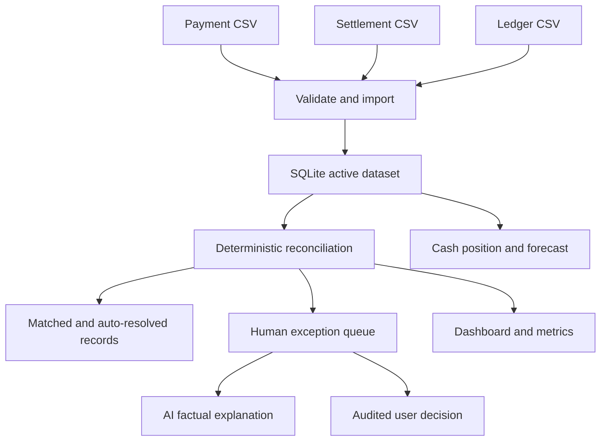

# FinRecon AI: Project and Interview Guide

## Project Condition

FinRecon AI is a working, deployed reconciliation application. The latest source commit is `1375c12` on `origin/main`; Render auto-deploys that branch. The public app is [finrecon-ai-aya7.onrender.com](https://finrecon-ai-aya7.onrender.com), with the dashboard at `/app` and health endpoint at `/api/health`.

The deployed dashboard currently runs against reproducible synthetic records. The app can accept operator-provided payment, settlement, and ledger CSV files, but imports are deliberately disabled on the current public Render free service. Enabling imports requires authentication and persistent storage; do not upload confidential financial data to the current public deployment.

The latest full backend test run passed 27 tests. The UI and API have been verified locally and on Render.

## Problem Statement

Payment operations usually maintain related records in separate systems:

- A payment gateway records what a customer paid.
- A bank or settlement provider records what was paid out, when, and with what fees.
- A merchant ledger records what finance booked.

These records can differ because of missing or late settlements, fee and tax discrepancies, partial settlements, duplicate submissions, reference mismatches, or incorrect ledger entries. Manual, spreadsheet-based matching is repetitive and makes it hard to explain or audit decisions.

**Problem:** Finance teams need a repeatable way to compare these records, identify discrepancies, prioritize human investigation, and understand the resulting cash position without trusting an opaque model to decide whether money moved correctly.

## Proposed Solution

FinRecon AI imports three CSV data sources, applies deterministic matching rules, classifies exceptions, and presents the results in a dashboard. An AI provider can explain a detected discrepancy, but it cannot decide whether records match or mark an exception resolved.

The reconciliation engine uses explicit amount, fee, tax, date, reference, and status rules. Records inside configured tolerances may be marked matched or auto-resolved; uncertain or material mismatches stay in the exception queue. Human exception actions are recorded in the audit log.

The cash position and forecast are calculated from the stored records. `OPENING_CASH` configures the starting balance and defaults to zero. Forecasts use a documented moving-average method, not a black-box prediction.

The product analyzes and explains money records. It does **not** initiate payments, transfer funds, or connect to a live bank feed.

## Main Workflow



### Data controls

- **Refresh Current View** fetches the latest state from the active database. It does not contact a payment provider or invent a new batch.
- **Run Reconciliation** recalculates results from the source records already stored. It does not clear or reseed those records.
- **Import CSV Data** validates all three files before replacing the active dataset. Invalid imports are rejected without replacing the existing records.
- The old dashboard-level demo reset control has been removed. A demo-reset API remains for synthetic evaluation and is disabled when CSV import mode is enabled.

The importer accepts the column names documented in the dashboard's import dialog. Payments require `transaction_id`, `payment_id`, `amount`, `fee`, `tax`, `status`, `transaction_timestamp`, and `bank_reference`. Settlements require `settlement_id`, `transaction_id`, `gross_amount`, `fee`, `tax`, `net_amount`, `settlement_date`, `settlement_status`, and `bank_reference`. Ledger records require `ledger_id`, `transaction_id`, and `ledger_amount`.

## Technology Stack

| Technology | Role | Why it is used here | Trade-off |
|---|---|---|---|
| Python 3 | Backend language | Clear data-processing code and fast iteration on reconciliation rules | A larger production deployment may need stronger concurrency and domain boundaries |
| Flask | REST API and static-file server | Small, explicit route layer; one process serves both API and dashboard | Authentication, validation, and operations must be added deliberately |
| SQLite | Local database | No separate database service; easy to run and test reproducibly | A single-file database is not a suitable shared production database without persistent storage and operational controls |
| HTML, CSS, vanilla JavaScript | Dashboard and landing page | No build chain or package installation; static assets call the same-origin API | A larger product may benefit from typed frontend components and a component test system |
| Gunicorn | Production WSGI server | Runs Flask behind Render's assigned port rather than Flask's development server | Production still needs durable storage, access controls, monitoring, and backups |
| Render | Hosting and auto-deploy | Deploys the repository's `render.yaml` Blueprint from GitHub `main` | The current free plan sleeps when idle and has ephemeral storage |
| unittest | Backend tests | Standard library test framework; tests deterministic rules and import safety | Browser workflow testing is currently manual |

This stack was chosen to keep the submitted application executable and testable end-to-end with a small dependency set. Flask and SQLite are an implementation choice for this verified build, not a claim that they are the final stack for handling production financial records. A future production version should use a managed database such as PostgreSQL, persistent backups, migrations, stronger user/role authorization, and monitored ingestion.

## What Makes It Different

1. **Rules decide; AI explains.** Match decisions are generated by deterministic code. An LLM is not asked to infer whether two financial records are the same.
2. **Exceptions stay visible.** Material or ambiguous differences are not silently marked resolved. A person can review and take an audited action.
3. **Results are measurable.** The seeded evaluation dataset contains known injected discrepancies, allowing repeatable checks of match rate, classifications, and false-positive resolution behavior.
4. **Cash is connected to the reconciliation data.** The dashboard reports payment, settlement, and ledger totals alongside a configured opening balance and a transparent forecast.
5. **The application has a real data workflow without moving money.** CSV ingestion supports operator-provided exports while keeping payments and transfers outside the application's responsibility.

## Current Limitations and Safety

- The hosted Render service is a public free demo using synthetic data and temporary SQLite storage.
- Do not import private or customer financial records into that deployment. Its import endpoint is intentionally disabled until an operator configures authentication, explicit opt-in, and persistent storage.
- Before enabling imports, configure `APP_USERNAME`, `APP_PASSWORD`, `FINRECON_ALLOW_IMPORT=true`, and `FINRECON_DB_PATH` in the server environment. On Render, persistent SQLite requires a persistent disk mounted at `/var/data`, then `FINRECON_DB_PATH=/var/data/finrecon.db`. The current free service does not provide that durable disk setup.
- Set `OPENING_CASH` to the actual starting balance for the accounting view. If unset, calculations start at zero and must not be described as the organization's bank balance.
- `AI_PROVIDER=mock` is the default. It provides deterministic, fact-grounded explanations. The optional OpenAI provider requires a server-side API key. Razorpay configuration is only a Test Mode connectivity check; it does not import transactions or execute payments.
- CSV import is a batch upload, not a live integration. Automated bank/gateway synchronization, real authorization roles, encryption/key management, backups, reconciliation policy review, and production accounting controls remain future work.

## Run and Verify

From the repository root:

```powershell
cd backend
python -m pip install -r requirements.txt
python -m unittest discover -s tests -v
python app.py
```

Open `http://localhost:8080`. For a production-style process on Linux, use the repository's WSGI entry point under Gunicorn:

```sh
cd backend
PORT=8080 gunicorn --workers 1 --chdir . wsgi:app --bind 0.0.0.0:$PORT
```

Useful routes include `/api/health`, `/api/dashboard/summary`, `/api/reconciliation/run`, and `/api/import`. CSV import replaces the active dataset, so enable it only with authentication and durable storage configured.

## Interview Explanation

### 30-second version

> FinRecon AI is a reconciliation and cash-visibility tool for payment operations. It compares payment-gateway, settlement, and ledger records using deterministic business rules, keeps uncertain discrepancies in a human-review queue, and calculates cash position and a short-term forecast. AI is limited to explaining facts the engine has already identified; it never decides a match or moves money. I built the verified version with Flask, SQLite, and a vanilla JavaScript dashboard, added secure-gated CSV ingestion, and deployed it on Render. The current hosted instance is a synthetic-data demo; real records require configured authentication and persistent storage.

### Two-minute version

> Finance teams often reconcile three versions of the same activity: what the gateway says was paid, what the bank settled, and what the ledger booked. A spreadsheet-based process is slow and makes exceptions difficult to audit. I built FinRecon AI to make that workflow repeatable.
>
> The application accepts payment, settlement, and ledger exports as CSV. It validates the files, stores the active dataset, then runs a deterministic reconciliation engine. The rules compare amounts, fees, taxes, settlement timing, references, and statuses. Clean records are matched; only small differences inside explicit tolerance bands may be auto-resolved. Everything material or ambiguous remains visible to a person.
>
> AI is deliberately outside the decision path. It receives the facts from a detected discrepancy and produces an explanation and suggested action. That keeps matching explainable and testable. The app also calculates cash position and a moving-average forecast from the same records, with the opening balance configured separately.
>
> I chose Flask and SQLite to deliver a small, reproducible system that runs locally without a separate database or frontend build. Gunicorn serves it on Render. The trade-off is that the current public free deployment is not suitable for private financial data: durable storage and authentication must be configured before imports are enabled. The key design principle is that the system can organize and explain money operations without ever initiating a money movement.

### Common Interview Questions

**Why not let an LLM match the transactions?**

A false match can hide a real financial discrepancy. The rule engine has explicit tolerances and can be tested against known cases. AI is useful for translating the detected facts into an explanation, but it is not the authority for the decision.

**How do you know the reconciliation logic works?**

The synthetic dataset is generated with a fixed seed and a known set of injected discrepancies. Tests check the categories, count invariants, cash arithmetic, forecast horizons, grounded explanations, and import behavior. The workflow tests also verify that reconciliation preserves source records and that an invalid CSV cannot replace an active dataset.

**What does refresh do?**

It reloads the active view from the database. It is intentionally not described as a live bank feed. New source data arrives through a validated CSV import today; automated provider synchronization would be a separate integration.

**Why SQLite instead of PostgreSQL?**

SQLite removes setup friction for a portable, single-process demonstration and made it possible to run the full system locally. It is not the production persistence choice for concurrent financial workflows. A production deployment needs a managed database, durable backups, migrations, and access controls.

**Is this production-ready for real transactions?**

The reconciliation and import workflow is implemented, but the public Render free instance is not approved for real customer data. It needs private access, configured credentials, persistent storage, backups, and operational review before handling sensitive records. It never executes transactions.

**What would you build next?**

I would add durable PostgreSQL storage and schema migrations, role-based authentication, secure import auditing and file retention controls, automated ingestion connectors with idempotency, and integration/browser tests. I would preserve the deterministic decision engine and maintain a reviewable audit trail.

### Resume Bullet

- Built and deployed FinRecon AI, a Flask-based reconciliation platform that validates payment, settlement, and ledger CSVs, applies deterministic matching rules, queues unresolved exceptions for human review, and computes cash forecasts; kept AI explanations outside the match-decision path and added tests for import safety and source-record preservation.
